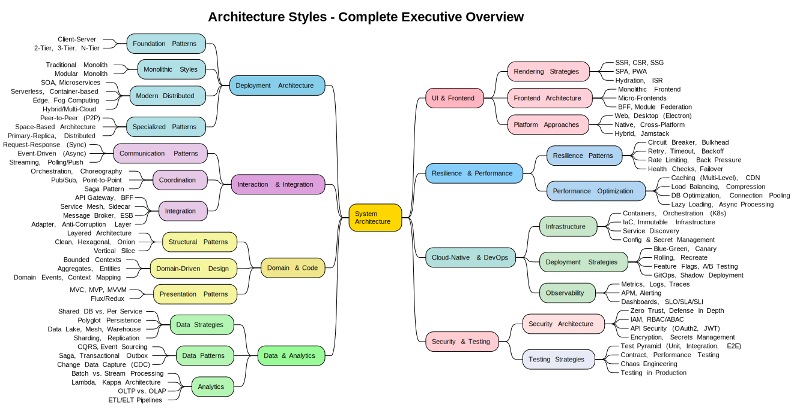

# Architecture Styles - Vollständige Übersicht

## Überblick

Dieses Dokument beschreibt alle wichtigen Systemarchitekturstile und -patterns, die in modernen Softwaresystemen verwendet werden. Die Architekturstile sind in 8 Hauptkategorien unterteilt.

## Diagramm

[PlantUML Source](diagrams/Architecture_Styles-Complete_Executive_Overview.puml)

---

## Dokumentationsstruktur

Diese Dokumentation ist modular aufgebaut. Jede Hauptkategorie hat eine eigene detaillierte Datei:

1. **[Deployment Architecture](Architecture_Styles/01_Deployment_Architecture.md)** - 16 Patterns
2. **[Interaction & Integration](Architecture_Styles/02_Interaction_Integration.md)** - 15 Patterns
3. **[Domain & Code](Architecture_Styles/03_Domain_Code.md)** - 10 Patterns
4. **[Data & Analytics](Architecture_Styles/04_Data_Analytics.md)** - 16 Patterns
5. **[UI & Frontend](Architecture_Styles/05_UI_Frontend.md)** - 13 Patterns
6. **[Resilience & Performance](Architecture_Styles/06_Resilience_Performance.md)** - 13 Patterns
7. **[Cloud-Native & DevOps](Architecture_Styles/07_Cloud_Native_DevOps.md)** - 14 Patterns
8. **[Security & Testing](Architecture_Styles/08_Security_Testing.md)** - 11 Patterns

**Patterns gesamt:** ~108

---

**Version:** 1.0 | **Datum:** 2024 | **Sprache:** Deutsch